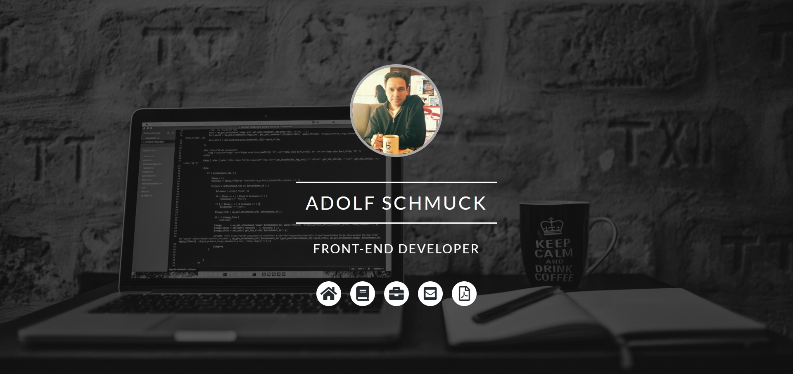
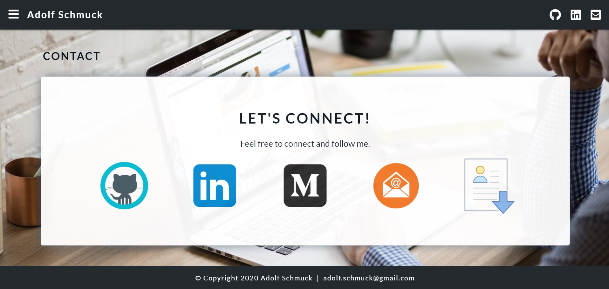

# Portfolio Website

# Project Description

This is my official portfolio website. The website includes a landing page, an About page, which includes a short embedded YouTube video I made to introduce myself and my website; a Portfolio page with front-end, back-end, and full-stack projects; a Freelance page with current live websites I've created and developed, and a Contact page.

This responsive front-end website was created using JavaScript, Materialize, CSS, and HTML. The font used ('Lato') come from Google Fonts. The icons used come from Font Awesome. The animated effects come from Animate.css. The video used on the About page is an embedded YouTube video, and is responsive as well. It was created using InVideo.

Open Graph Tags have been added so that when a link to or from the website is shared and posted (e.g. on Facebook), the desired image and text will be shown (see screenshot #5 below). A sitemap has been added and submitted to Google, and Google Search Console is used for this website to check the indexing status and to optimize the visibility of the website.

# Technologies Used

* JavaScript
* Animate.css
* Materialize
* CSS
* HTML

# Portfolio Website

Please check out the link below for my Portfolio website:

https://adolfschmuck.com/

# Screenshots

